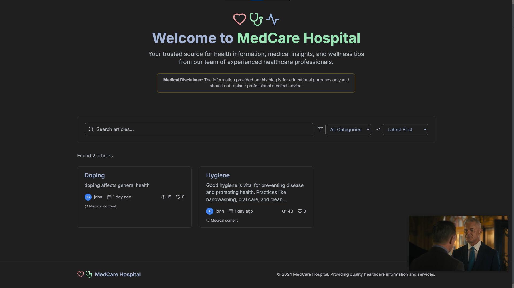
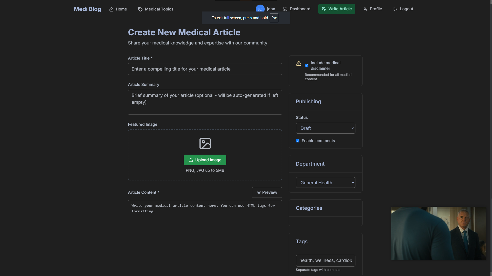
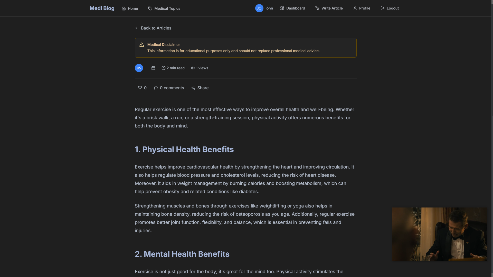
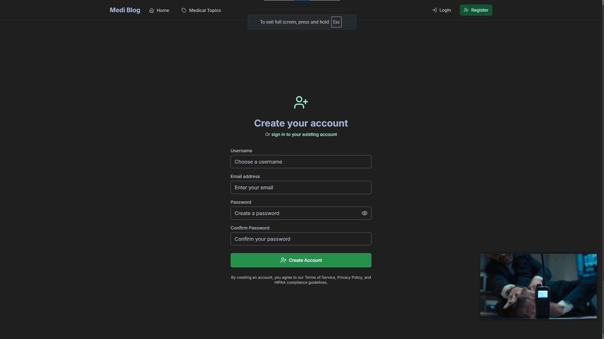

Thanks! Based on your clarification, here's an updated **README.md** that reflects the correct features:

---

````markdown
# 🩺 Health & Medical Blog App

A full-stack MERN (MongoDB, Express, React, Node.js) application where users of all roles — patients, doctors, nurses, and admins — can write, read, like, and comment on health and medical blogs. Built for open discussion and health education sharing.

---

## 🚀 Features

- 📝 Create, edit, and delete blogs (all users)
- 💬 Comment on and ❤️ like blogs
- 🔐 Secure authentication (JWT)
- 🧑‍⚕️ Role-based registration (patient, doctor, nurse, admin)
- 🖼️ Upload avatar (optional)
- 🗂️ Blogs categorized by specialization or department
- 📱 Responsive UI with React & TailwindCSS

---

## 📸 Screenshots

> 📌 Add screenshots in the `/screenshots` folder and link them below.

### 🏠 Homepage


### ✍️ Write a Blog


### 📄 Read Blog + Comments


### 🔐 Register/Login


---

## 🧰 Tech Stack

**Frontend:**
- React
- React Router
- Tailwind CSS
- Axios
- React Hook Form

**Backend:**
- Node.js
- Express
- MongoDB + Mongoose
- JWT Authentication
- Joi Validation

---

## 🛠️ Installation

### 1️⃣ Backend
```bash
cd server
npm install
npm run dev
````

### 2️⃣ Frontend

```bash
cd client
npm install
npm start
```

### 🌐 Open App

```
http://localhost:3000
```

---

## ⚙️ Environment Variables

Create a `.env` file in the **server** folder:

```
PORT=5000
MONGO_URI=your_mongodb_uri
JWT_SECRET=your_jwt_secret
```

---

## 👥 User Roles

All users can create blogs, like, and comment. Roles help customize experience or permissions later.

| Role    | Description                             |
| ------- | --------------------------------------- |
| Patient | General user writing or reading content |
| Doctor  | May focus content on expertise          |
| Nurse   | Can share practical health tips         |
| Admin   | Has future access to moderation tools   |

---

## 🧱 Folder Structure (Optional)

```
/client
  /components
  /pages
  /contexts
  App.js
/server
  /routes
  /controllers
  /models
  /middleware
  server.js
/screenshots
.env
README.md
```

---

## 📌 Future Enhancements

* Admin dashboard for moderation
* Blog tagging and filtering
* Markdown editor for blog writing
* Notifications for comments/likes

---

## 🧑‍💻 Author

* [Your Name](https://github.com/yourusername)

---

## 📄 License

This project is licensed under the MIT License.

```

---

Let me know if you'd like me to turn this into a downloadable `README.md` or include badges (e.g. build, license, tech stack).
```
